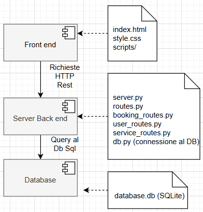

# Guida all'Avvio del Server Python

## Overview
Per avviare il server Python, seguire i passaggi indicati di seguito.

## Installazione
1. Installare **Python 3**.
2. Installare i file necessari eseguendo il comando seguente nella cartella di progetto (dove si trova il file `requirements.txt`):  
   ```sh
   pip install -r requirements.txt
   ```

## Utilizzo
1. Dopo aver installato tutte le dipendenze, avviare il server con il comando:  
   ```sh
   python server.py
   ```
2. Per accedere all'applicazione in esecuzione, aprire il browser e visitare:  
   [http://localhost:8000](http://localhost:8000)

## Disponibilità dell'Applicazione Online
L'applicazione è disponibile anche online ai seguenti indirizzi:
- [http://15.160.130.231:8000/](http://15.160.130.231:8000/)
- [https://manfredipiraino.com](https://manfredipiraino.com)

## Documentazione Server (Work in Progress)
Per accedere alla documentazione del server, visitare il link seguente:  
[https://manfre3d.github.io/project_work_docs/](https://manfre3d.github.io/project_work_docs/)

La documentazione è stata generata con **Sphinx**. Il codice sorgente della documentazione è disponibile nel repository:  
[https://github.com/manfre3d/project_work_docs](https://github.com/manfre3d/project_work_docs)

## Documentazione Frontend (Work in Progress)
Per accedere alla documentazione del frontend, visitare il link seguente:  
[https://manfre3d.github.io/project_work_docs/](https://manfre3d.github.io/project_work_docs/)

La documentazione è stata generata con **JSDoc**. Il codice sorgente della documentazione è disponibile nel repository:  
[https://github.com/manfre3d/project_work_docs](https://github.com/manfre3d/project_work_docs)

## Struttura di progetto

Di seguito un diagramma UML dei componenti che illustra la struttura di base del progetto:

